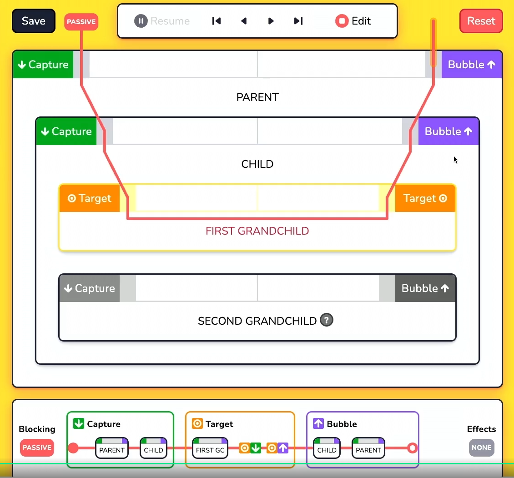

# Manipulando Eventos en el DOM
Los eventos existen en casi todos los lenguajes de programación, desde el navegador hasta los servidores, y es porque siempre vamos a querer que nuestro código sea dinámico con respecto a ciertas acciones del usuario.  
He aquí una definición más formal:

***Evento***: En programación, es una acción o suceso que ocurre en un elemento HTML, que puede ser detectado por JavaScript. Estos pueden ser:
- Interacción del usuario (clicks, teclas presionadas, movimiento del mouse, etc.)
- Cambios de estado del navegador (cuando la página termina de cargar)
- Actualizaciones en el DOM (cuando un elemento cambia)

Para poder agregar eventos al código se utiliza el método `.addEventListener()` el cual se mantiene en espera de que el evento determinado suceda para poder ejecutar el código que se encuentra dentro.

#### Tipos de Eventos
- De mouse
- De teclado
- Del objeto `window()` del navegador
- De un formulario
- Táctiles
- etc.

#### Flujo de un evento
Se refiere al punto donde inicia el evento y el punto donde finaliza.

Flujo:
- Capturing: aquí inicia el evento, se recorre el DOM desde el objeto padre `window()` hasta llegar al objeto que disparo ese evento
- Target: es el objeto que disparó el evento
- Bubbling: Vuelve al objeto `window()`



<br>

## Agregar y eliminar Event Listeners

```javascript
// Cambiar color de background al pasar el mouse por encima
const container = document.querySelector('.container');
const button = document.querySelector('button');
container.addEventListener('mouseover', () => {
    container.style.backgroundColor = 'Blue';
})

// Regresar al color original al salir del contenedor
container.addEventListener('mouseout', () => {
    container.style.backgroundColor = 'Red';
})

// Mensaje de alerta después de hacer click en el botón
button.addEventListener('click', () => {
    alert('Button clicked!');
})

// Callback de la función anterior
const buttonClickCallback = () => {
    alert('Button clicked!');
}

// Agregamos un EventListener al botón
button.addEventListener('click', buttonClickCallback);

// Agregamos un contador para borrar el eventListener después de cierto tiempo
setTimeout(() => {
    button.removeEventListener('click', buttonClickCallback);
}, 2000)
```

## El objeto evento o eventObject

```javascript
const button = document.querySelector('button');
const buttonClicked = (event) => {
    console.log(event.target);
    console.log(event.target.id);
    console.log(event.target.textContent);
};
button.addEventListener('click', buttonClicked)
```

<br>

## Manejo de entradas de formulario y validación

```javascript
const form = document.getElementById('myForm');

form.addEventListener('submit', (event) => {
    event.preventDefault()
    const name = form.elements['name'].value;
    console.log(name);
})
```

<br>

## Delegación de eventos y prevención de comportamiento predeterminado

### Delegation


Sin delegation pattern
```javascript
const listItems = document.querySelectorAll('li');
    
listItems.forEach((item) => {
    item.addEventListener('click', (event) =>{
    event.target.classList.toggle('highlight')
    })
})

```

Aplicando delegation pattern
```javascript
const list = document.querySelector('ul');

list.addEventListener('click', (event) => {
    event.target.closest('li')
    
})
```
